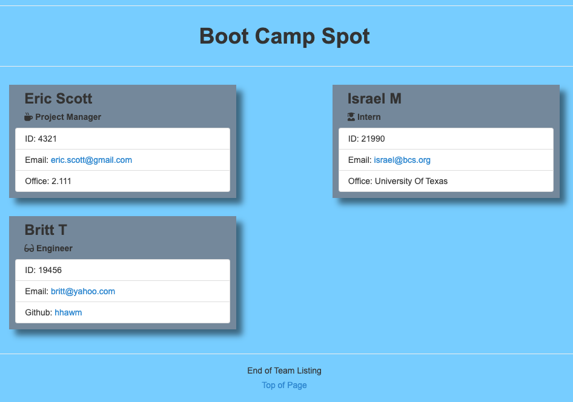

# Unit 10 OOP Homework: Template Engine - Employee Summary

The application will prompt user for information about the team name and its project manager. Next it will prompt the user to add either an intern or an engineer with their information. The user can input any number of team members, and they may be a mix of engineers and interns. When the user has completed building the team, the application will create a folder called 'example' and a teampage.HTML file that displays a nicely formatted team roster based on the information provided by the user. We can frame this challenge as follows:

```
As a manager
I want to generate a webpage that displays my team's basic info
so that I have quick access to emails and GitHub profiles
```

Here are some guidelines:

There is a `package.json`, so make sure to `npm install`.

The dependencies are, [jest](https://jestjs.io/) for running the provided tests, and [inquirer](https://www.npmjs.com/package/inquirer) to prompt the user for their email, id, and specific information based on their role with the company. For instance, an intern may provide their school, whereas an engineer may provide their GitHub username

App will run as a Node CLI to gather information about each employee.

There are also unit tests for each type of employee to test each class. You can run the tests at any time with `npm run test`.

Screenshot here:

</img>